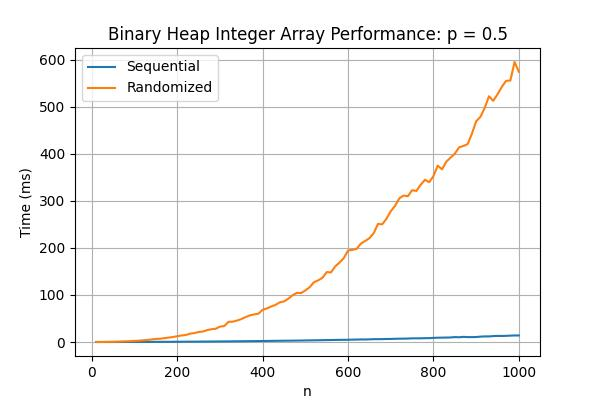
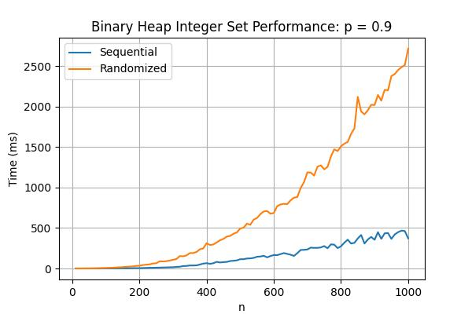
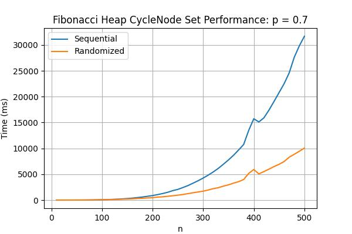

# Results & Discussions

## Experimental Environment

The experiment is conducted on the following system:

- **Processor (CPU)**: AMD Ryzen 7 6800H with Radeon Graphics, 3.20 GHz (8 cores, 16 threads)
- **RAM**: 24 GB, 4800 MT/s, SODIMM
- **Disk Storage**: 477 GB SSD (NVMe)
- **Operating System**: Windows 11

---

## Binary Heap Dijkstra Performance

### Integer Array

### Integer Set

### CycleNode Set

The results show that the **randomized Dijkstra algorithm takes more time** than the sequential variant across all graph structures.  
This is expected because the randomized variant uses a large number of **decrease-key operations**, which take `O(log n)` time in a Binary heap—the same as `extract-min`.

> Therefore, the randomized Dijkstra does **not improve** the algorithm's running time when using the Binary heap.

---

## Fibonacci Heap Dijkstra Performance

### Integer Array

### Integer Set

### CycleNode Set

The results show that the **randomized Dijkstra algorithm still takes more time** than the sequential variant for graphs using **integer arrays and sets**, but it performs **better** for the **CycleNode** set structure.

This is **contrary** to the calculations presented in the original paper. There are several possible explanations:

1. **Implementation Issues**
    - My implementation may not be fully optimized like it might not be **cache-friendly**, or
    - The machine may not have sufficient **RAM or cache bandwidth** to efficiently run the algorithm.

2. **Graph Size Limitation**
    - The improvement in time complexity promised by the algorithm may only become significant for **very large graphs**.
    - The number of vertices in the benchmark may not be large enough to observe this effect.

3. **Theoretical vs Practical Gap**
    - It's possible the algorithm works **well in theory** but lacks the **practical efficiency or optimization** required for real-world performance.

---
